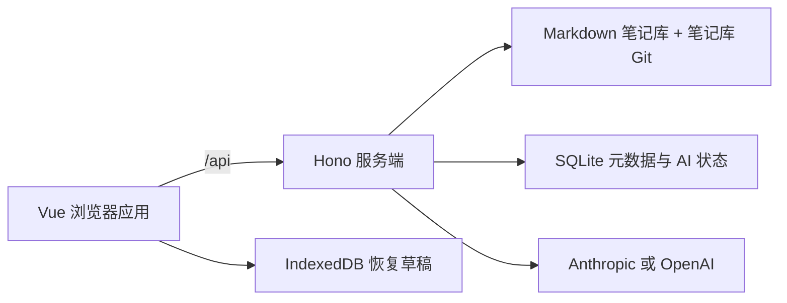

# Docus

[English](README.md) · [文档中心](docs/README.md) · [部署指南](docs/deployment/overview.md)

Docus 是一个可自托管的 Markdown 知识工作区，用于写作、整理、链接、版本管理，以及按需使用 AI。笔记始终是普通文件；Docus 在此基础上提供 Vue 界面、安全的服务端文件操作、SQLite 元数据、显式 Git 版本和浏览器草稿恢复。


## 主要能力

- **文件式 Markdown 笔记库**：在 `inbox`、`literature` 和 `archive` 中保留可独立读取的 `.md` 文件。
- **专注的编辑与阅读体验**：Monaco 编辑器、安全过滤的 Markdown、任务列表、脚注、Mermaid、Markmap 与 Wiki 链接。
- **可靠保存**：自动保存、比较基线冲突检测、原子写入、生命周期锁与启动时崩溃恢复。
- **草稿恢复**：使用浏览器 IndexedDB 保存有容量上限的未保存缓冲区。
- **元数据与搜索**：SQLite 管理标题、摘要、标签和稳定文档 ID，并提供文件树筛选和命令面板。
- **链接与反向链接**：解析 Wiki 链接和相对 Markdown 链接，在支持的重命名与移动中协调引用。
- **显式历史版本**：在笔记库自身的 Git 仓库中创建、比较、恢复和撤回版本。
- **可选 AI**：支持 Anthropic 或 OpenAI，提供实时工作区上下文以及受校验的文件/元数据工具。
- **自托管运行时**：一个生产进程同时提供 Vue 应用与 Hono API，并附带 Docker Compose。

## 快速开始

需要 Node.js 22 或 24、npm 和 Git。

```bash
npm ci
mkdir -p src/content/inbox src/content/literature src/content/archive
npm run dev
```

打开 Vite 输出的地址，通常为 `http://localhost:5173`。

源码开发模式要求先创建三个笔记库根目录；生产服务会自动补齐缺失的初始根目录。详细说明见[安装](docs/getting-started/installation.md)和[快速开始](docs/getting-started/quick-start.md)。

## 系统组成



浏览器不会直接写笔记文件。服务端统一负责路径校验、归档规则、文件事务、SQLite 协调、历史版本和 provider 凭据。不同存储的备份语义并不相同；生产使用前请阅读[架构概览](docs/architecture/overview.md)和[存储架构](docs/architecture/storage.md)。

## 笔记库模型

默认笔记库是 `src/content/`，也可通过 `VAULT_DIR` 指向其他路径。

```text
src/content/
├── inbox/       活跃笔记与新材料
├── literature/  阅读与来源笔记
└── archive/     需要保留且受到约束的归档笔记
```

三个根目录不能重命名或删除。笔记可从活跃目录移入 `archive`；归档笔记不能通过 Docus 重命名、删除或移回活跃区。详见[笔记库与归档协议](docs/user-guide/vault.md)。

## 生产部署

推荐使用 Docker Compose：

```bash
docker compose up -d --build
curl --fail http://127.0.0.1:3000/api/health
```

Compose 默认只绑定 `127.0.0.1:3000`，将 `./src/content` 挂载为笔记库，并把 SQLite 与托管的 AI 主密钥保存在 `docus-data` 卷中。

Docus **不提供**身份认证或 TLS。请保持回环地址或私有网络访问；如需远程访问，应在前方配置带认证的 TLS 反向代理。备份必须同时包含笔记库（包括隐藏的 `.git`）和 `data/`。

- [部署概览](docs/deployment/overview.md)
- [Docker 指南](docs/deployment/docker.md)
- [运行时配置](docs/deployment/configuration.md)
- [安全清单](docs/deployment/security.md)
- [备份与恢复](docs/deployment/backup-and-restore.md)

## 配置

主要服务端设置：

| 变量 | 默认值 | 用途 |
| --- | --- | --- |
| `VAULT_DIR` | `<cwd>/src/content` | 笔记库根目录 |
| `HOST` | `127.0.0.1` | 裸机监听地址 |
| `PORT` | `3000` | 裸机监听端口 |
| `DOCUS_MASTER_KEY` | 未设置 | 显式的 32 字节 AI 凭据主密钥 |
| `DOCUS_MASTER_KEY_FILE` | 未设置 | 存放主密钥的文件 |

AI provider、API key、模型和可选 base URL 在应用 Settings 中配置，而不是使用 provider 专用环境变量。未提供显式主密钥时，Docus 会在首次保存 API key 时创建 `data/.docus-master-key`。

完整优先级和 Docker 专用变量见[配置说明](docs/getting-started/configuration.md)。

## 文档导航

[文档中心](docs/README.md)是规范入口。

- [用户指南](docs/user-guide/overview.md)
- [架构文档](docs/architecture/overview.md)
- [开发环境](docs/development/setup.md)
- [测试说明](docs/development/testing.md)
- [设计系统](docs/design/icon-system.md)
- [元数据迁移](docs/migrations/document-metadata.md)
- [历史文档归档](docs/archive/README.md)

当前行为均记录在 `docs/archive/` 之外。带日期的计划、规格、验收证据和实现记录仅为追溯而保留，不代表当前规范。

## 开发与验证

```bash
npm run typecheck
npm run build
npm test
npm run lint:icons
```

浏览器测试：

```bash
npm run test:e2e
npm run test:e2e:draft-store
```

CI 使用 Node.js 22 在 Ubuntu 上验证生产版本兼容性，并使用 Node.js 24 在 Ubuntu、macOS 和 Windows 上进行跨平台验证，同时运行崩溃恢复、浏览器 E2E、视觉基线和 Docker smoke 测试。

## 项目状态

`package.json` 当前版本为 `0.0.0`。Docus 仍是持续开发中的应用，而不是已经发布稳定兼容性承诺的产品。升级前请备份真实笔记库，阅读[变更日志](CHANGELOG.md)，并使用数据副本验证部署变更。

## 许可证

仓库当前没有许可证文件。在维护者补充明确许可条款之前，请不要默认拥有再分发或复用本项目的权利。
