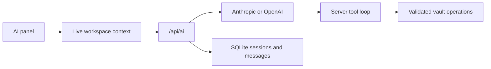

# AI Architecture

The browser streams conversations through server routes. The server owns provider credentials, builds live workspace context, calls Anthropic or OpenAI, executes tools, and persists sessions and messages.

## Request path

Context may represent the current document, a comparison, or a recovery view. For an edited document it can include the unsaved browser buffer rather than only the disk copy. Attachments are identified by validated workspace paths.

## Tool execution

Docus currently exposes eight model tools:

- `read_file`
- `update_metadata`
- `list_files`
- `create_file`
- `write_file`
- `patch_file`
- `delete_file`
- `rename_file`

Tool calls execute automatically. They reuse path validation, archive policy, and document mutation safeguards where applicable. A multi-step AI run is not an all-or-nothing database transaction: successful earlier calls remain applied if a later call fails.

## Credentials

Provider, model, base URL, and API key are configured in Settings and stored in SQLite. API keys are encrypted with AES-256-GCM using a 32-byte master key resolved in this order:

1. `DOCUS_MASTER_KEY`
2. `DOCUS_MASTER_KEY_FILE`
3. auto-created `data/.docus-master-key` when a key is first saved

The master key is not stored in SQLite. Losing it makes stored provider keys unreadable; exposing it together with the database exposes those keys.

## Trust boundary

AI output is untrusted input. Tool safety policy blocks unsupported or unsafe mutations, but users should still review results and keep backups. The AI Markdown renderer disables raw HTML. See [AI Assistant](../user-guide/ai.md) and [Security Model](security.md).

