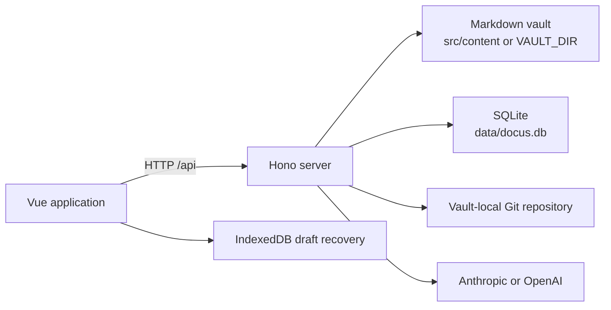

# Architecture Overview

Docus is a local-first Markdown workspace. The browser provides the Vue user interface, while a Hono server owns file-system mutations, SQLite metadata, AI provider calls, and the vault's Git history.

## Runtime shape

The development server is Vite with the API mounted as a plugin. Production uses `server/prod.ts`, which serves both the built client and the same API.

## Main boundaries

- `src/` owns the Vue interface, browser state, Markdown rendering, editor tabs, and draft recovery.
- `server/` owns trusted file access, lifecycle transactions, SQLite, history, links, and AI integration.
- `shared/` contains rules needed on both sides, such as archive policy and link resolution.
- `src/content/` is the default vault. A production deployment can choose another path with `VAULT_DIR`.
- `data/` holds server-managed state. It is not part of the vault.

The browser does not write vault files directly. Mutations go through server routes so path validation, archive rules, compare-and-swap checks, locking, journaling, metadata updates, and reference rewrites stay coordinated.

## Data ownership

| Data | Owner | Persistence |
| --- | --- | --- |
| Markdown files and folders | User / vault | File system |
| Version history | Docus history service | `.git` inside the vault |
| Titles, summaries, tags, stable document IDs | Metadata service | SQLite |
| AI settings, sessions, messages | AI service | SQLite |
| Unsaved recovery drafts | Browser | IndexedDB |
| UI preferences and tab state | Browser | Local storage / browser state |

These stores have different backup and recovery semantics. See [Storage](storage.md), [History](history.md), and [Backup and Restore](../deployment/backup-and-restore.md).

## Design principles

1. Markdown remains readable outside Docus.
2. Durable mutations are coordinated on the server.
3. External edits are detected instead of silently overwritten.
4. History is explicit: autosave does not create a Git version.
5. Browser drafts are a recovery layer, not the authoritative copy.
6. Historical design records live under [`docs/archive/`](../archive/README.md); the architecture directory describes only shipped behavior.

## Related documentation

- [Storage](storage.md)
- [Edit and Save](edit-and-save.md)
- [Document Lifecycle](document-lifecycle.md)
- [Crash Recovery](crash-recovery.md)
- [Security Model](security.md)

