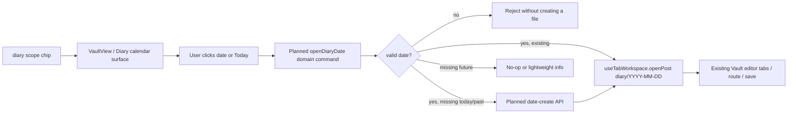
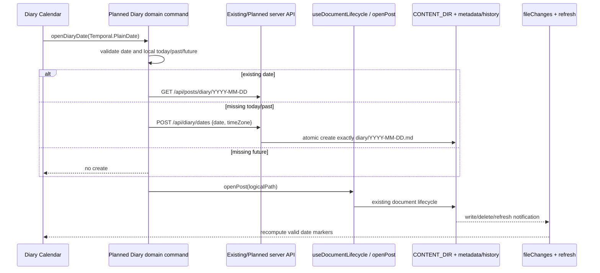
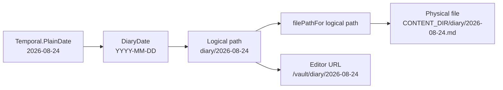

# Diary Calendar PRD

状态：`REVIEW-READY`（仅完成 PRD、仓库现状审计与技术可行性确认；尚未实现）

日期：2026-08-24
范围：Diary 产品模型、存储协议、日历交互、编辑器复用与实施边界

## 1. 摘要

Diary 不是另一套编辑器，也不是把笔记改造成传统的日记列表。它是 Docus `diary` scope 的日期入口：用户通过一个轻量日历查看哪些日期已经有内容，点击日期后进入现有 Vault 编辑流程。

核心定义：

> Diary 以日期作为文档身份，以日历作为导航，以现有 Markdown 文档生命周期作为唯一的读写、历史与恢复通道。

每个日期最多对应一个 Diary 文档。日期文档使用稳定、可推导的路径：

| 层级 | 约定 |
| --- | --- |
| 日历日期 | `YYYY-MM-DD`，使用 `Temporal.PlainDate` 表达日期值 |
| Docus logical path | `diary/YYYY-MM-DD`，不带 `.md` |
| 磁盘物理路径 | `CONTENT_DIR/diary/YYYY-MM-DD.md` |
| 编辑器 URL | `/vault/diary/YYYY-MM-DD` |
| 日历标记 | 每个有效日期一个 all-day marker/event，不把拖拽或调整大小作为操作入口 |

`diary/` 根目录是 Docus 保留的固定功能根目录；它不能被用户重命名、删除、移动或 re-parent。根目录下的有效内容是日期文档，而不是任意文件夹树。

Diary 的产品限制是日期领域规则，不是新的文件系统权限模型。所有 path traversal、绝对路径、root escape、symlink/junction confinement、auth、CSRF/origin、原子写入、锁、history、draft recovery 等安全与可靠性边界继续由现有 Docus 机制负责。

## 2. 目标与非目标

### 2.1 目标

- 在 `diary` scope 提供 Calendar-first 的日期导航。
- 桌面端使用 Month Grid；小屏使用 Month Agenda 或等价的 agenda 视图。
- 用低干扰的点/标记表示已有 Diary 日期。
- 点击今天、过去日期或已有未来日期时，复用现有编辑器打开逻辑。
- 今天或过去日期没有文档时，可以创建当天/补记文档。
- 缺失的未来日期不创建文档；已有的未来日期仍可打开和编辑。
- 通过严格日期路径保证“一天一个文档”，不使用 `-2`、`-3` 等 collision suffix。
- 让 Diary 文档继续使用现有 editor tabs、save、history、draft recovery、delete 与 selection 生命周期。
- 将 Diary 规则同时落实到 UI、server/API、AI 工具边界，避免只做前端限制。
- 保留文件树作为现有内容的可见和清理入口；Calendar 不吞掉 Docus 原有的文件管理能力。

### 2.2 非目标

- 不实现独立的 `DiaryEditor`、`DiarySave`、Diary history 或 Diary recovery。
- 不引入数据库日记记录、UUID diary entity 或第二套文档身份系统。
- 不实现重复日记、周期日记、提醒、情绪/天气字段、日历事件编辑、拖拽改期或 resize。
- 不实现 `diary/year/month` 或任意嵌套 Diary 文件夹。
- 不把 Markdown 文件扩展名暴露到 Docus logical path 或 URL。
- 不改变 `note` scope；`note` 仍只包含 `inbox`、`literature`、`archive`，`diary` 继续是独立 scope。
- 不改变 Archive Soft-Policy、`useArchiveNote()` 默认目标、archive collision handling 或 protected roots 的既有语义；本 PRD 只新增/明确 Diary 的根目录契约。
- 不放宽现有 filesystem、auth、history、recovery 安全边界。
- 本阶段不安装依赖、不修改生产代码、不修改测试实现；下文的 API、组件和文件名是后续实现提案。

## 3. 仓库现状审计

### 3.1 当前已存在的 Diary 能力

仓库目前没有 Diary domain、日期协议、Calendar 页面或 Diary API。当前只有 scope 和导航层面的预留：

| 位置 | 当前事实 | 对本 PRD 的影响 |
| --- | --- | --- |
| [`shared/scopeProtocol.ts`](../../shared/scopeProtocol.ts) | `diary` scope 已映射到 `['diary']`；`note` 仍映射到 `['inbox', 'literature', 'archive']` | 不需要改变 scopeProtocol；后续只增加 Diary domain 规则 |
| [`src/components/NavBar.vue`](../../src/components/NavBar.vue) | 已有 diary scope chip | 复用现有 scope 入口，不新建平行导航体系 |
| [`src/components/vault/icons.ts`](../../src/components/vault/icons.ts) | 已有 diary icon | 可复用现有视觉系统 |
| `src/components/`、`src/views/`、`src/composables/` | 没有 Diary Calendar 或 Diary editor | 后续只新增 Calendar 视图/组件，不复制编辑器生命周期 |
| `src/content/` | 当前没有 `diary/` 根目录 | 启动 seed 需要补充固定根目录，并同时修正 dev/prod 一致性 |

### 3.2 路径与文件身份

[`server/paths.ts`](../../server/paths.ts) 已经定义了 Docus 的核心路径边界：

- logical path 必须是相对、无前后 `/`、由合法 slug segment 组成的路径。
- `normalizeLogicalContentPath()` 会去掉一个末尾 `.md`，并继续以 extensionless logical path 作为应用层身份。
- `filePathFor(path)` 将 logical path 映射为磁盘上的 `path + '.md'`。
- `folderPathFor(path)` 映射到目录本身。
- `assertSafePath()` 以及异步 secure resolver 负责 CONTENT_DIR confinement、绝对路径拒绝、`..` 拒绝和 symlink/junction 检查。

因此 Diary 不应绕过这些 helper，也不应把 `diary/YYYY-MM-DD.md` 当作路由、编辑器 tab 或 API path。

[`server/tree.ts`](../../server/tree.ts) 会递归扫描 CONTENT_DIR，仅将 `.md` 文件暴露为 extensionless `PostSummary.path`；现有 `diary/foo.md` 若存在，目前会被当作普通文档返回。Diary 实现必须在此基础上做严格分类，而不是修改全局 `.md` 映射规则。

### 3.3 Scope、路由与编辑器生命周期

- [`src/lib/api.ts`](../../src/lib/api.ts) 的 `PostSummary.path`、`PostDetail.path`、`getPost()`、`createPost()`、`patchPost()`、`deletePost()` 都使用 extensionless logical path。
- [`src/router/index.ts`](../../src/router/index.ts) 使用 `/vault/:pathMatch(.*)*` 承载 logical path，不带 `.md`。
- [`src/views/VaultView.vue`](../../src/views/VaultView.vue) 已创建 `fileChanges`、editor tabs 和 `useDocumentLifecycle`，这些是 Calendar 打开/创建日期文档的正确接入点。
- [`src/composables/vault/editor-tabs/useTabWorkspace.ts`](../../src/composables/vault/editor-tabs/useTabWorkspace.ts) 的 `openPost()`、`refresh()`、路径迁移和 active route 更新可以直接服务 Diary。
- [`src/composables/vault/useDocumentLifecycle.ts`](../../src/composables/vault/useDocumentLifecycle.ts) 已覆盖 create、rename、delete、folder lifecycle、draft/recovery、tab selection 等通用流程。Diary 不应复制这些流程。
- [`src/composables/vault/context/fileChanges.ts`](../../src/composables/vault/context/fileChanges.ts) 已提供 write/delete/rename 通知和 refresh 协作点，Calendar 的日期标记应由现有 refresh/file change 结果驱动。
- [`src/composables/vault/draft-recovery/serverDocumentResolver.ts`](../../src/composables/vault/draft-recovery/serverDocumentResolver.ts) 以稳定 document ID 找回当前 path；Diary 仍然遵守这一约定。

### 3.4 Server、seed 与通用 mutation

| 位置 | 当前事实 | Diary 设计约束 |
| --- | --- | --- |
| [`server/seed.ts`](../../server/seed.ts) | `INITIAL_FOLDERS` 当前是 `inbox`、`literature`、`archive`；`ensureInitialFolders()` 幂等创建根目录 | 后续增加 `diary`，并保留冲突告警与幂等性 |
| [`server/prod.ts`](../../server/prod.ts) | 生产启动会调用 `ensureInitialFolders(CONTENT_DIR)` | 生产根目录初始化可复用 |
| [`server/vite-plugin.ts`](../../server/vite-plugin.ts) | 当前 Vite dev 启动没有调用同一个 seed helper | 后续必须补齐 dev/prod 一致性，避免开发环境缺少 `diary/` |
| [`server/documentMutationPolicy.ts`](../../server/documentMutationPolicy.ts) | 目前只按 exact protected root 保护 `inbox`、`literature`、`archive`；archive descendants 已是普通内容 | 后续扩展 root contract 时只增加 `diary` 根保护，不恢复 archive subtree gate |
| [`server/routes/posts.ts`](../../server/routes/posts.ts) | 通用 POST 可按合法 path 创建文件；PUT 编辑；PATCH 支持文件 rename/move；DELETE 有生命周期安全 | Diary 需要在通用入口增加 domain guard，避免 generic create/rename/move 绕过日期规则；编辑/删除仍复用既有流程 |
| [`server/routes/folders.ts`](../../server/routes/folders.ts) | 创建文件夹、同父目录 rename、递归删除；不支持通用跨父目录 folder re-parent | Diary 下不允许创建子目录；root 仍不可 rename/delete/move |
| [`server/ai/tools.ts`](../../server/ai/tools.ts) | AI 有 read/list/create/write/patch/delete/rename file 工具，没有 folder mutation 工具 | generic AI 工具必须遵守 Diary domain guard，不能成为旁路 |

当前 `archive` root 的保护仍由 [`shared/archiveProtocol.ts`](../../shared/archiveProtocol.ts) 等现有规则负责；本 PRD 不改变 Archive Soft-Policy 的结果：archive descendants 仍按普通用户内容处理，Archive action 仍默认写入 `archive/<filename>`。

### 3.5 文档与现有生命周期契约

- [`docs/user-guide/vault.md`](../user-guide/vault.md) 已明确 `.md` 只存在于磁盘，Docus path/URL 不带扩展名，并记录 protected roots、Archive soft policy 与 folder re-parent 当前不支持。
- [`docs/architecture/document-lifecycle.md`](../architecture/document-lifecycle.md) 已将 mutation、metadata stable ID、folder rename journal、history、recovery 和 archive protocol 定义为现有生命周期契约。
- [`docs/architecture/storage.md`](../architecture/storage.md)、[`docs/architecture/edit-and-save.md`](../architecture/edit-and-save.md)、[`docs/architecture/security.md`](../architecture/security.md) 分别约束 Markdown/SQLite/Git storage、保存与 draft recovery、auth/path/atomic safety。

Diary 应作为这些架构的一个领域入口，而不是创建第二套持久化和编辑生命周期。

## 4. 产品模型

### 4.1 Diary 根目录

`diary/` 是固定的 Docus system root：

| Operation | `diary/` root |
| --- | --- |
| list/read | YES |
| Calendar date command 创建有效日期文档 | YES |
| generic New File | NO |
| generic New Folder | NO |
| rename root | NO |
| delete root | NO |
| move/re-parent root | NO |
| 作为任意普通文件夹被移入/移出 | NO |

禁止 generic New File/New Folder 是为了保证 `diary/` 下不会重新出现不满足日期协议的内容；这不是 filesystem readonly，也不影响通过 Calendar 创建日期文档。

### 4.2 有效 Diary 日期文档

有效 managed Diary document 的 path 必须严格满足：

`diary/YYYY-MM-DD`

其中：

- `YYYY` 为四位年份。
- `MM` 为两位月份，范围 `01`–`12`。
- `DD` 为两位日期，必须是该月实际存在的日期。
- 必须通过 `Temporal.PlainDate` 的日历日期解析与 round-trip 校验；例如 `2026-02-31`、`2026-2-3`、`diary/foo`、`diary/2026-08-24-extra` 均无效。
- `diary/2026-08-24.md` 在应用层应规范化为 `diary/2026-08-24`，但 UI、URL、API response 和 editor tab 不显示 `.md`。
- `diary` 下不允许 `year/month` 子目录或日期之外的 nested folder。

日期是文档身份；Markdown title、frontmatter title、summary、tags 等元数据可以编辑，但不能改变该文档对应的日期 path。

### 4.3 有效文档的能力矩阵

| Operation | `diary/YYYY-MM-DD` |
| --- | --- |
| read/open | YES |
| edit content | YES |
| edit title/summary/tags metadata | YES；不能改变日期 path |
| delete | YES；走普通 delete、history、draft recovery 和 current-selection 流程 |
| rename | NO |
| move within `diary` | NO |
| move into/out of `diary` | NO |
| create child file/folder | NO |
| drag/re-parent | NO |
| 通过 Calendar 创建 | 仅 today/past 的缺失日期 YES |

这里的 rename/move 禁止是 Diary 的日期身份约束，不是 archive-style subtree readonly。Diary 文档仍可读、写、删，仍是普通 Markdown 文档，且必须保留现有 editor/history/recovery 安全边界。

### 4.4 无效或外部遗留内容

如果在实现前或实现后，磁盘上已有 `diary/` 下不满足日期 schema 的文件，例如 `diary/legacy.md` 或 `diary/2026/08/24.md`：

- 不自动删除、不自动重命名、不自动归并、不自动改造成日期文档。
- 不自动追加 `-2`、`-3`，也不让它覆盖有效日期文档。
- 文件树/通用 posts listing 可以继续显示它，保证数据可见和可清理。
- Calendar 只把严格有效的 `diary/YYYY-MM-DD` 纳入日期标记；无效内容不应污染日历。
- 后续 domain guard 不得把无效遗留文件静默“提升”为 managed Diary document。
- 是否在 Diary UI 显示低噪音的“未归档 schema 内容”计数/入口，列为实现阶段的产品选择；不做 modal 或阻断式迁移。

这使 schema 迁移具有可逆性，也避免为了得到干净日历而破坏用户已有文件。

## 5. 日期状态与创建规则

### 5.1 日期来源

Diary 是 date-only 产品，不是带时区的时间事件：

- 用户当前日期取浏览器/客户端本地 civil date。
- 使用 `Temporal.Now.plainDateISO()` 或等价的本地 `Temporal.PlainDate` 获取“今天”。
- 禁止通过 `new Date().toISOString().slice(0, 10)` 推导用户的今天；UTC 日界线可能把内容创建到错误日期。
- 日历显示和 path identity 均使用 `Temporal.PlainDate`/`YYYY-MM-DD`，不做 midnight timestamp 转换。
- 创建请求应携带浏览器的 IANA time zone，例如 `Asia/Shanghai`，供 server 判断 future；time zone 是产品输入，不是 auth 或 filesystem security 边界。

### 5.2 状态机

| 用户动作 | 日期状态 | 结果 |
| --- | --- | --- |
| 点击今天 | 文档已存在 | 打开 `diary/YYYY-MM-DD` 对应 path |
| 点击今天 | 文档不存在 | 创建一次并打开 |
| 点击过去日期 | 文档已存在 | 打开 |
| 点击过去日期 | 文档不存在 | 创建一次并打开，作为补记 |
| 点击未来日期 | 文档已存在 | 允许打开、编辑或删除；不因 future 身份冻结 |
| 点击未来日期 | 文档不存在 | 不创建；轻量提示或无操作，不弹确认 modal |
| 重复点击已有日期/并发创建 | 文档已存在或 create race | 打开同一个 `diary/YYYY-MM-DD`；不产生第二个文件、不加 suffix |

`openDiaryDate(date)` 是后续实现中建议的单一入口。它先将 `PlainDate` 转换为 logical path，查询/创建符合上述状态，然后调用现有 `openPost()`。任何 Calendar slot、日期单元格、agenda row 或 Today 控件都不得各自复制一份创建判断。

### 5.3 创建内容与幂等性

当前通用 `POST /api/posts` 的默认 body 是 `# ${title}\n`。Diary MVP 建议沿用这一既有行为，以 `# YYYY-MM-DD\n` 作为新日期文档的初始内容，不另建 template engine；空文档作为替代方案留在实现评审中。

Diary 创建必须是 create-only：

- 目标固定为 `diary/YYYY-MM-DD`。
- 已存在时返回该文档，不创建新文件。
- 并发请求只有一个物理 create；失败方重新读取同一 logical path 后打开。
- 不使用 Archive 的 `uniqueMoveTarget` 或 `-2`/`-3` collision suffix。
- invalid date、future missing date、nested path 和任意 filename 都应在 domain 层明确拒绝，不退化为普通 generic create。

## 6. Calendar 交互方案

### 6.1 视图选择

选用 Schedule-X 的 Vue 集成，桌面端 Month Grid、小屏 Month Agenda：

- Desktop：按月展示，日期格显示一个低干扰 dot/marker。
- Mobile/small viewport：使用 agenda 视图，显示有内容的日期，保留日期点击和空日期导航入口。
- Schedule-X 官方文档说明 Month Grid 适合 large view、Month Agenda 适合 small view，并存在约 700px 的响应式断点；因此不能只配置 Month Grid 后再期待它自动成为可用的手机列表。
- MVP 不需要 event drag/drop、resize、recurrence 或 event editor；日历 event 只是 Diary 文档存在性的展示模型。

推荐初版同时配置 Month Grid 和 Month Agenda，使用官方的 responsive view 配置。若首期必须压缩范围，桌面 Month Grid 可以先实现，但必须把 Month Agenda 作为 Phase 1.1 的明确交付，而不是永久忽略移动端。

### 6.2 点标记与数据来源

Calendar 的 source of truth 仍是 Docus posts/tree 数据，而不是 Schedule-X 自己的存储：

1. 通过现有 `listPosts()`/tree refresh 获得所有 logical paths。
2. 过滤严格合法的 `diary/YYYY-MM-DD`。
3. 为每个有效日期建立一个 all-day marker event，event id 建议为 `diary:${date}`。
4. 使用 `Temporal.PlainDate` 表达 event 日期；不把 Diary 事件转换成带时间戳的 UTC event。
5. 通过 `monthGridEvent`、`monthAgendaDateDots` 或对应的官方 custom slot 渲染 dot/日期内容。
6. 禁用 event DND/resize；点击 event、date cell、agenda date 都调用同一个 `openDiaryDate()`。

Schedule-X calendar instance 不是 Vue reactive state；官方 Vue 文档明确建议不要把 instance 放入 Vue `ref`。后续实现应保留普通 calendar instance，并用 `@schedule-x/events-service` 的 `set/add/update/remove` 更新 events。现有 `fileChanges`、`refresh()` 和 tab lifecycle 仍是 Docus 内部状态同步入口，不新增第二套 event bus。

### 6.3 Today 与日期导航

- Today 控件将当前本地 `Temporal.PlainDate` 传给 Schedule-X calendar controls 的 `setDate()`。
- URL 只有用户打开文档后才进入现有 `/vault/diary/YYYY-MM-DD` editor route；单纯浏览月份不应制造文档或改写 active document。
- 点击已有日期的 marker 与点击该日期 cell 结果一致。
- 点击没有文档的 today/past 日期才触发 domain create；浏览日历、切换月份、`onRangeUpdate` 不触发 create。
- `onRangeUpdate` 可作为未来 server range API 的接缝，但 MVP 不需要单独的 `/api/diary/range`，避免维护第二个列表数据源。

## 7. 编辑器与生命周期集成

Diary 的实现边界应是：Calendar 提供日期导航，Vault 提供文档生命周期。

后续实现建议复用以下 seam：

- Calendar surface 放入现有 `VaultView`/scope 工作流，或作为 diary scope 的子视图；不建立平行 editor shell。
- 日期 command 最终调用 `useTabWorkspace.openPost(logicalPath)`，让 route、active tab、document metadata 与 refresh 走现有逻辑。
- 创建可通过 `useDocumentLifecycle.createFile()` 参与现有 fileChanges、refresh、history/recovery；若 server domain endpoint 返回已创建/已存在的 post，客户端仍只调用一次生命周期入口。
- 编辑直接使用现有 Monaco/document save、compare-base、lock、atomic write、metadata stable ID。
- 删除使用 `useDocumentLifecycle.deleteFile()`，保留 draft recovery、history/quarantine、关闭当前 tab 和 active selection 更新。
- 不增加 Diary 专属 rename/move UI；有效 Diary path 的 path identity 不可变。
- 文件树继续可以显示和清理内容；Calendar 是日期导航，不是另一份内容列表。

典型数据流如下：

日历 event 更新必须服从 fileChanges/refresh 的真实结果；不能在 create API 请求发出后就乐观地永久添加 marker，也不能绕过 history/recovery。

## 8. Proposed domain protocol 与 API

本阶段只写协议，不实现。后续实现应将日期规则集中在 `shared/diaryProtocol.ts`（名称可在 implementation plan 中微调）并与现有 path/root policy 叠加：

### 8.1 Diary protocol 职责

- 判断 `diary` root、valid managed date path、invalid/unmanaged descendant。
- 将 `Temporal.PlainDate` 与 logical path 双向映射。
- 验证严格 `YYYY-MM-DD` 和真实 calendar date。
- 判断 root、managed date、nested folder/invalid child 的操作边界。
- 提供 domain reason/code，供 server/UI 生成清晰的非 archive-specific 错误。
- 不代替 `server/paths.ts` 的 confinement、secure resolver 或 `documentMutationPolicy` 的 auth/security checks。

建议的概念映射：

### 8.2 推荐的日期创建 API

推荐新增一个小的 domain endpoint，而不是把 Calendar 的创建语义伪装成通用 `POST /api/posts`：

`POST /api/diary/dates`

request 概念字段：

- `date`: `YYYY-MM-DD`。
- `timeZone`: 浏览器当前 IANA timezone，例如 `Asia/Shanghai`。

行为约定：

- valid today/past 且不存在：原子创建并返回 `201`、`created: true` 与 `PostSummary`。
- valid today/past 且已存在：返回 `200`、`created: false` 与现有 `PostSummary`。
- 两个请求并发创建同一天：只允许一个物理文件；竞争失败的一方重新读取并按“已存在”返回，不产生 suffix。
- valid future 且不存在：返回可区分的业务错误，例如 `422`/明确 reason；不创建。
- invalid date、nested path 或非日期输入：返回 `400`/明确 validation reason。
- root、auth、path confinement、CSRF/origin、atomic create 和 metadata/history 等仍由现有 server boundary 负责。

> `GET /api/posts` 仍可作为 MVP 的日期标记数据源。只有在 posts 数量或 range performance 证明需要时，才增加 `GET /api/diary/range?from=...&to=...`；不要在第一版同时维护两套列表一致性。

### 8.3 通用 API 的防旁路规则

后续 server 实现需在 mutation route 和共享 validation 层落实，而不能只隐藏菜单：

| Entry point | Diary 规则 |
| --- | --- |
| generic `POST /api/posts` | 拒绝在 `diary/` 下创建任意 filename；有效日期创建走 domain endpoint |
| `PUT /api/posts/diary/YYYY-MM-DD` | 允许内容编辑；path 不变 |
| `PATCH /api/posts/diary/YYYY-MM-DD` with `name` | 拒绝；日期是 identity |
| `PATCH /api/posts/diary/YYYY-MM-DD` with `targetPath` | 拒绝；不允许 move in/out 或 within diary |
| `DELETE /api/posts/diary/YYYY-MM-DD` | 允许，走现有 delete lifecycle |
| `POST /api/folders` under `diary` | 拒绝新建子文件夹 |
| folder root rename/delete/move | `diary` root 与现有 protected roots 一样拒绝 |
| AI generic create/rename/move | 不得成为旁路；复用同一 domain validation |
| AI edit/delete existing managed date | 可以按普通文档生命周期允许，继续经过 tool safety/auth/locks |

如果后续要让 AI “写今天日记”，应新增一个复用同一 Diary domain service 的高层命令，而不是放宽 generic `create_file`。

## 9. Schedule-X 技术可行性确认

本审计已核对 Schedule-X 官方文档和官方仓库：

- Vue wrapper 可以使用 `ScheduleXCalendar`、`createCalendar`、`createViewMonthGrid` 和 `createViewMonthAgenda`，并要求 calendar 容器有明确宽高：[`Vue integration`](https://schedule-x.dev/docs/frameworks/vue)。
- `selectedDate`、`onClickDate`、`onClickAgendaDate`、`onRangeUpdate`、`onSelectedDateUpdate` 和 responsive callback 均有官方配置入口：[`Calendar configuration`](https://schedule-x.dev/docs/calendar/configuration)。
- Month Grid 与 Month Agenda 的大小视图限制和响应式行为有明确文档；本方案采用两者组合：[`Calendar views`](https://schedule-x.dev/docs/calendar/views)。
- all-day event 支持 `Temporal.PlainDate`；Month Grid/Agenda 也支持 custom slots，可用于 dot marker：[`Events`](https://schedule-x.dev/docs/calendar/events)。
- event 数据可以通过 `@schedule-x/events-service` 的 `set/add/update/remove` 更新；这适合接现有 refresh/fileChanges，而无需把 calendar instance 做成 Vue ref：[`Events Service`](https://schedule-x.dev/docs/calendar/plugins/events-service)。
- Today/日期跳转可通过 `@schedule-x/calendar-controls` 的 `setDate()` 等 API 完成：[`Calendar Controls`](https://schedule-x.dev/docs/calendar/plugins/calendar-controls)。
- Schedule-X v4 将 drag-and-drop/resize 的高级能力拆到 premium；Diary 不需要事件拖拽或 resize，因此 MVP 不依赖 premium：[`Schedule-X v4`](https://schedule-x.dev/blog/schedule-x-v4)。官方开源仓库为 MIT：[`schedule-x/schedule-x`](https://github.com/schedule-x/schedule-x)。

### 9.1 计划中的依赖

实现阶段再按当时锁定的官方文档和 package manager resolution 增加依赖，不在本 PRD 阶段安装或锁死版本。预计核心包为：

- `@schedule-x/vue`
- `@schedule-x/calendar`
- `@schedule-x/theme-default`
- `@schedule-x/events-service`
- `@schedule-x/calendar-controls`
- `temporal-polyfill`

官方 Vue 文档还提示某些 npm peer-dependency 组合可能需要 `@preact/signals` 与 `preact`；实施时以实际 lockfile 和官方安装说明为准，不在设计阶段手工猜版本。

### 9.2 风险与缓解

| 风险 | 影响 | 缓解 |
| --- | --- | --- |
| Temporal polyfill 的 bundle/SSR/TS typing | 日历初始化或构建兼容性 | D3 先做最小组件 smoke test；保留 date-only 边界测试 |
| Calendar instance 非 reactive | events 不刷新或重复初始化 | instance 只创建一次；用 events service 同步 |
| Month Grid 在小屏不可用 | mobile UX 退化 | 同时配置 Month Agenda，不依赖单一视图压缩 |
| 全量 `listPosts()` 规模增长 | 月份切换与首屏成本 | MVP 复用现有 source；以真实数据量为依据再引入 range API |
| 外部 invalid diary files | 日历与文件树不一致 | 严格过滤、保留原文件、非阻断诊断 |
| generic API/AI 绕过 | 日期身份和 one/day 被破坏 | server/shared domain guard 覆盖所有 mutation entry points |
| dev/prod seed 不一致 | 开发环境无法进入 Diary | 统一调用 `ensureInitialFolders()` |

## 10. 文档、文案与可访问性

Diary 的用户文案应解释“按日期进入文档”，而不是制造第二种笔记类型：

- scope label：沿用现有 diary 文案/图标。
- 空日期或 missing today/past：可使用简短的“创建这一天的日记”文案。
- missing future：不弹确认；可使用一次性的轻量说明“未来日期尚未创建”。
- invalid unmanaged content：如果提供提示，应是低噪音诊断，不得阻塞打开、编辑或清理。
- 日历日期单元格、marker、Today、Month Agenda row 都必须有可访问名称；dot 不能是唯一语义来源。
- 不为每次打开日期、保存或删除发送 advisory toast；成功/错误反馈沿用现有 Vault lifecycle。

后续实现文档应在用户指南中说明：

- Diary root 是 Docus 保留目录。
- 一个有效日期对应一个 Markdown 文档。
- Docus logical path 不带 `.md`，磁盘文件带 `.md`。
- 今天/过去缺失日期可从 Calendar 创建；未来缺失日期不会预创建。
- Diary 内容仍使用普通编辑、历史、draft recovery 和删除安全流程。
- 日期文档不能 rename/move，因为日期 path 是身份；这不是 archive readonly。

## 11. 分阶段实施计划

### D0 — PRD、审计与评审（本阶段）

- 完成仓库现状审计与 Schedule-X 官方能力确认。
- 固化路径、日期、root、创建、future、invalid-file 和 editor reuse 契约。
- 不改生产代码、不改测试、不安装依赖。

### D1 — Diary domain protocol

- 新增共享 Diary date/path validation 与 classification。
- 扩展 protected-root contract 到 `diary`，不改变 note scope。
- 补协议测试：valid/invalid date、logical/physical mapping、root/managed/unmanaged classification。

### D2 — Seed、server contract 与 mutation guards

- `ensureInitialFolders()` 增加 `diary`，并让 prod/dev 使用同一初始化路径。
- 新增 date create domain endpoint，保证 today/past、one/day、no suffix、race idempotence。
- 在 posts/folders/AI mutation entry points 统一应用 Diary guard。
- 允许 valid date 的 edit/delete；拒绝 managed date rename/move、generic create、nested folder create。
- 保留现有 path/auth/atomic/history/recovery checks。

### D3 — Calendar surface

- 按官方 Schedule-X Vue 集成接入 Month Grid + Month Agenda。
- 加载有效 Diary dates，渲染 marker/dot，接 Today、date click、event click。
- 用 events service 更新 event；不启用 drag/drop/resize/premium。

### D4 — Vault editor/lifecycle integration

- 接 `openDiaryDate()` 到现有 `openPost()`/`useDocumentLifecycle`。
- 接 fileChanges、refresh、tab selection、draft recovery、delete 后 marker 更新。
- 验证日历点击创建不会创建重复文档，current document 删除行为与普通文档一致。

### D5 — Responsive、可访问性与 release gate

- 验证桌面 Month Grid、小屏 Month Agenda、键盘/屏幕阅读器、Today 和空日期。
- 处理 invalid unmanaged content 的低噪音诊断（若评审选定）。
- 执行 typecheck、build、定向 unit/integration/E2E、path/auth/history/recovery 回归。
- 更新用户指南、架构文档、CHANGELOG；发布前检查 Archive、note scope 与普通 Markdown lifecycle 未回归。

## 12. 测试与验收标准（后续实现必须满足）

### 12.1 Protocol 与 path tests

- `diary` 是 protected root；rename/delete/move/re-parent root 均失败。
- `diary/YYYY-MM-DD` 是有效 managed path；错误月份、错误日期、大小写/格式错误和 nested path 均失败。
- logical path、URL 和 API path 不含 `.md`；physical `filePathFor()` 只在磁盘映射时追加 `.md`。
- 日期 round-trip 稳定；不得因本地时区或 UTC 把日期改写。
- 一个 date 只能映射到一个 logical/physical file。

### 12.2 Server/API tests

- today missing 创建成功并返回单一文档。
- past missing 创建成功，可用于补记。
- future missing 被拒绝且不产生文件。
- existing future 可以 GET、PUT、delete。
- duplicate/concurrent create 不产生 suffix 或第二个文件。
- managed date content edit 成功。
- managed date rename、move-in、move-out、within-diary move 失败。
- generic post create under `diary`、arbitrary filename 和 folder create 失败。
- invalid external file 不被自动删除、覆盖或重命名；calendar filter 忽略它。
- protected root rename/delete/move 仍失败。
- auth、CSRF/origin、path traversal、absolute path、symlink/junction、root escape regression 保持通过。

### 12.3 Calendar/UI tests

- 已有日期显示 marker；没有文档的日期不显示 marker。
- 点击 existing/today/past/future 四种状态进入正确 state machine。
- future missing 不发 create request。
- Today 使用本地 civil date，不使用 UTC slice。
- marker/date/agenda click 均打开同一 logical path。
- Calendar 复用现有 `openPost`，不会创建 DiaryEditor 或平行 tab/save state。
- create/delete/refresh/fileChanges 会增删 marker，且当前 tab/route/selection 正确。
- desktop Month Grid 与小屏 Month Agenda 可用；event DND/resize 不会改变文档 path。
- 日期 cell/marker/agenda row 可通过键盘和辅助技术理解。

### 12.4 回归 tests

- `note` scope 仍只包含 inbox/literature/archive；`diary` scope 仍独立。
- Archive action、archive collision suffix、archive file CRUD/move 和 protected roots 不变。
- 普通文档 editor、folder same-parent rename/delete、history、recovery、draft recovery、AI tool safety 不回归。

## 13. Open questions（带推荐决策）

这些是需要评审确认的实现选择，不是当前实现阻塞：

1. **Month Agenda 是否进入第一版？** 推荐与 Month Grid 同时进入 MVP，因为官方视图限制意味着只做 Month Grid 会让小屏体验不完整。若必须缩短首期，可以把 Agenda 放到 Phase 1.1，但要在排期中明确。
2. **invalid unmanaged content 如何提示？** 推荐在 Diary scope 提供低噪音计数/跳转入口，不弹 modal、不自动迁移；若产品更重视简洁，首期只保留文件树可见性和文档说明。
3. **Calendar 与文件树关系？** 推荐 Calendar 作为 diary scope 的主导航，同时保留现有 FileTree 作为内容清理和 invalid 文件可见入口；不建议以日历替换通用树。
4. **future 判定由谁提供 timezone？** 推荐客户端提交浏览器 IANA timezone，server 只负责一致性校验；替代方案是固定 server timezone，优点是实现简单，缺点是跨时区用户会看到错误的“今天/未来”。
5. **新日期初始 Markdown？** 推荐沿用现有 `POST /api/posts` 的 `# YYYY-MM-DD\n` 行为，避免新增 template engine；替代方案是空文档，优点是更安静，缺点是与当前 create semantics 不一致。
6. **是否首期增加 range API？** 推荐不增加，先复用 `listPosts()` 并按严格 Diary path 过滤；只有数据规模证明全量 posts 不足时再新增 range endpoint。

## 14. 完成定义

本 PRD 进入实现评审的条件：

- [x] 已确认当前 `diary` 只有 scope 预留，没有现成 Diary domain/calendar/API。
- [x] 已确认 Docus logical path 不带 `.md`，物理文件由 `filePathFor()` 映射为 `.md`。
- [x] 已确认 `note` scope 不应包含 diary。
- [x] 已定义 `diary/` root、valid managed date、invalid unmanaged content 三类边界。
- [x] 已定义 one/day、no suffix、today/past/future 和 local date 规则。
- [x] 已定义 Calendar 与现有 editor/history/recovery 的复用边界。
- [x] 已核实 Schedule-X Vue、Month Grid/Agenda、events service、calendar controls 与 premium 边界。
- [x] 已定义 generic API、folder API、AI 工具不能绕过 Diary domain guard。
- [x] 已列出实施阶段、测试矩阵、风险与 open questions。
- [ ] 生产代码、测试、依赖和 lockfile 已实现并验证（不属于本阶段）。

## 15. 评审结论

Diary 在当前 Docus 架构中技术可行，最小正确路径是“新增日期领域规则 + 复用现有 Markdown lifecycle + Calendar 作为导航 UI”。关键不可妥协的边界是：

1. `diary/` root 固定保留，但不把整个 subtree 做成 filesystem readonly。
2. 日期文档的 logical path 是 `diary/YYYY-MM-DD`，physical file 才是 `.md`。
3. Calendar 创建只允许 today/past 缺失日期；future 只允许打开已有文档。
4. 日期 path 是 identity，因此 managed date 不 rename/move，但仍可 edit/delete。
5. one/day 使用固定 path 和 create-only 原子语义，不使用 collision suffix。
6. 所有入口（UI、server、AI）共享同一个 domain contract。
7. Archive、note scope、filesystem/auth/history/recovery 和现有 Vault lifecycle 不因 Diary 设计被放宽或重写。

本文件完成的是设计与审计，不代表 Diary 已经实现，也不代表 Schedule-X 依赖已经加入仓库。
