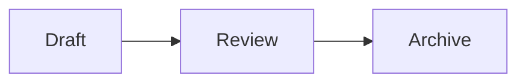

# Markdown, Links, and Diagrams

## Supported Markdown

Docus renders Markdown with `markdown-it` and supports the core syntax plus:

- task lists;
- heading anchors;
- footnotes;
- definition lists;
- `==marked text==`;
- tables and syntax-highlighted code fences;
- automatic links;
- Wiki links;
- Obsidian-style callouts;
- KaTeX inline and block math;
- Mermaid and Markmap fences.

## Callouts

Docus supports Obsidian-style callouts. A marker at the start of a blockquote
turns that blockquote into a lightweight, typed note while the content inside
continues to use normal Markdown.

```md
> [!note]
> This is a note.
```

You can provide a title after the type:

```md
> [!warning] Important
> Back up your data first.
```

The canonical types are `note`, `info`, `tip`, `success`, `question`,
`warning`, `danger`, `bug`, `example`, and `quote`. Common Obsidian aliases
such as `caution`, `done`, `hint`, and `error` are normalized to their
canonical type. Unknown types use the `note` appearance. Foldable callouts
(`+` / `-` markers) are not enabled.

## Mathematics

Docus renders math with KaTeX. Use single dollar delimiters for an inline
formula:

```md
Euler's identity is $e^{i\pi}+1=0$.
```

Use a `$$` block for a display formula:

```md
$$
\int_0^1 x^2\,dx = \frac{1}{3}
$$
```

Inline formulas stay on one line. Dollars in code spans/fences and escaped
dollars such as `\$100` remain literal text. KaTeX supports a high-performance
subset of LaTeX math syntax; this build does not provide MathJax, equation
numbering, or user-defined global macros.

## Links Between Notes

Use Wiki links or relative Markdown links:

```md
[[inbox/example]]
[[inbox/example|Readable label]]
[[inbox/example#heading]]
[Readable label](../inbox/example.md)
```

Known targets navigate inside the vault. Missing Wiki targets are styled as missing. Links inside inline or fenced code are not indexed.

When renaming a file or folder, Docus can update incoming Wiki and Markdown references. The Links panel shows both outgoing links and backlinks for the current note.

## Diagrams

Use a `mermaid` fence for diagrams and a `markmap` fence for an interactive outline map:

````md


```markmap
# Topic
## Branch
- Detail
```
````

Mermaid runs with `securityLevel: 'strict'`. Both diagram types are mounted only after the sanitized Markdown render completes.

## HTML Safety

Semantic HTML is enabled for compatibility, but the final rendered HTML passes through a DOMPurify allowlist before Vue inserts it. Scripts, event handlers, styles, iframes, embedded objects, SVG, forms, and unsafe URLs are removed. AI chat Markdown is stricter and disables raw HTML entirely.

For the full boundary, see [Deployment Security](../deployment/security.md).
