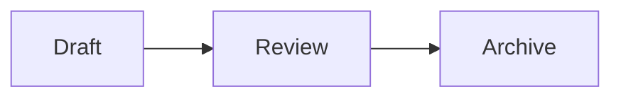

# Markdown, Links, and Diagrams

## Supported Markdown

Docus renders Markdown with `markdown-it` and supports the core syntax plus:

- task lists;
- heading anchors;
- footnotes;
- definition lists;
- `==marked text==`;
- tables and syntax-highlighted code fences;
- automatic links;
- Wiki links;
- Mermaid and Markmap fences.

## Links Between Notes

Use Wiki links or relative Markdown links:

```md
[[inbox/example]]
[[inbox/example|Readable label]]
[[inbox/example#heading]]
[Readable label](../inbox/example.md)
```

Known targets navigate inside the vault. Missing Wiki targets are styled as missing. Links inside inline or fenced code are not indexed.

When renaming a file or folder, Docus can update incoming Wiki and Markdown references. The Links panel shows both outgoing links and backlinks for the current note.

## Diagrams

Use a `mermaid` fence for diagrams and a `markmap` fence for an interactive outline map:

````md


```markmap
# Topic
## Branch
- Detail
```
````

Mermaid runs with `securityLevel: 'strict'`. Both diagram types are mounted only after the sanitized Markdown render completes.

## HTML Safety

Semantic HTML is enabled for compatibility, but the final rendered HTML passes through a DOMPurify allowlist before Vue inserts it. Scripts, event handlers, styles, iframes, embedded objects, SVG, forms, and unsafe URLs are removed. AI chat Markdown is stricter and disables raw HTML entirely.

For the full boundary, see [Deployment Security](../deployment/security.md).
