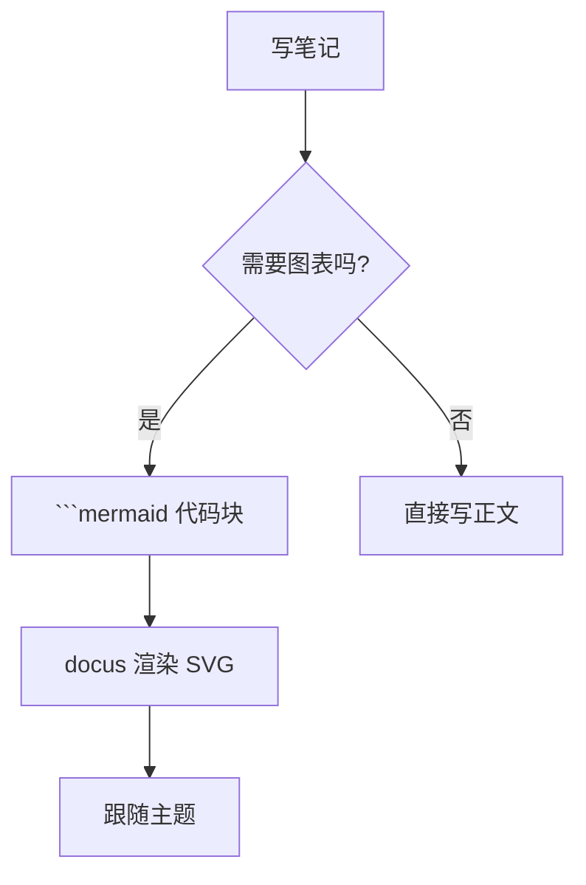
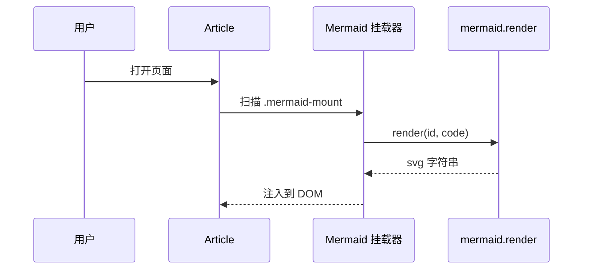
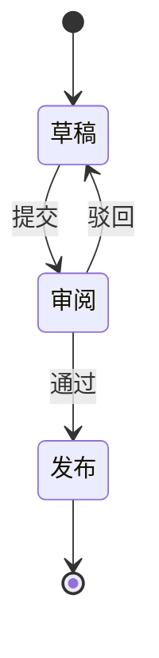

# Mermaid 图表示例

使用 ```` ```mermaid ```` 代码块写 Mermaid 语法，docus 会把它渲染成 SVG。

## 流程图



## 时序图



## 状态图



## 用法

把 ```` ```mermaid ```` 包住的 Mermaid 语法当作正文写进去就行。主题会跟随 docus 的明暗模式自动切换 —— 暗色下 mermaid 的 token 会被重写成 docus 的暗色调。
