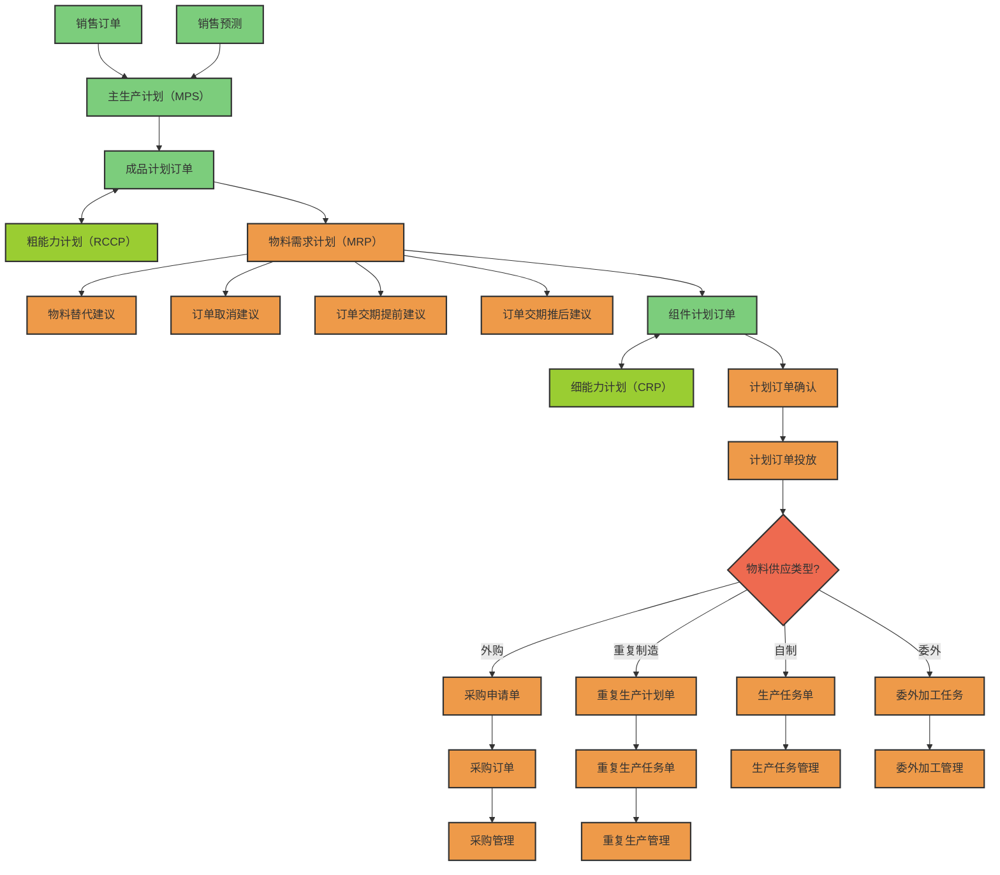
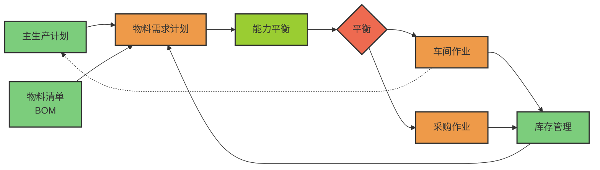

主生产计划（Master Production Schedule，简称MPS）是闭环计划系统的组成部分，通过协调销售规划与生产资源，制定具体时间段内最终产品生产数量及交货期的独立需求计划。它以经营规划为基础，将产品系列具体化并驱动物料需求计划，需通过粗能力计划验证可行性。

MPS根据生产类型确定计划对象：库存生产模式下计划对象为成品；订单装配模式下聚焦基础组件。其编制遵循最少项目、关键资源等原则，采用时段划分（周/日/月）平衡供需稳定性，并通过需求时界与计划时界控制调整范围。作为MRPⅡ系统的核心模块，MPS在计划管理中起到承上启下的枢纽作用。

## 1. 基本简介

在信息化行业，MPS是指主生产计划。简单地说， MPS是确定每一具体的最终产品在每一具体时间段内生产数量的计划；有时也可能先考虑组件，最后再下达最终装配计划。这里的最终产品是指对于企业来说最终完成、要出厂的完成品，它要具体到产品的品种、型号。这里的具体时间段，通常是以周为单位，在有些情况下，也可以是日、旬、月。主生产计划详细规定生产什么、什么时段应该产出，它是独立需求计划。主生产计划根据客户合同和市场预测，把经营计划或生产大纲中的产品系列具体化，使之成为展开物料需求计划的主要依据，起到了从综合计划向具体计划过渡的承上启下作用。

主生产计划说明在可用资源条件下，企业在一定时间内，生产什么？生产多少？什么时间生产？

## 2. 作用和意义
**作用**  
主生产计划是按时间分段方法，去计划企业将生产的最终产品的数量和交货期。主生产计划是一种先期生产计划，它给出了特定的项目或产品在每个计划周期的生产数量。这是个实际的详细制造计划。这个计划力图考虑各种可能的制造要求。

主生产计划是关于“将要生产什么”的一种描述，它根据客户合同和预测，把销售与运作规划中的产品系列具体化，确定出厂产品，使之成为展开MRP与CRP（细能力计划）运算的主要依据，它起着承上启下，从宏观计划向微观过渡的作用。

主生产计划是计划系统中的关键环节。一个有效的主生产计划是生产对客户需求的一种承诺，它充分利用企业资源，协调生产与市场，实现生产计划大纲中所表达的企业经营目标。主生产计划在计划管理中起“龙头”模块作用，它决定了后续的所有计划及制造行为的目标。在短期内作为物料需求计划、零件生产计划、订货优先级和短期能力需求计划的依据。在长期内作为估计本厂生产能力、仓储能力、技术人员、资金等资源需求的依据。

**意义**  
为什么要先有主生产计划，再根据主生产计划制订物料需求计划？直接根据销售预测和客户订单来制订物料需求计划不行吗？产生这样的疑问和想法的原因在于不了解MRP的计划方式。概括地说：MRP的计划方式就是追踪需求。如果直接根据预测和客户订单的需求来运行MRP，那么得到的计划将在数量和时间上与预测和订单需求完全匹配。但是，预测和客户订单是不稳定、不均衡的，直接用来安排生产将会出现时而加班加点也不能完成任务，时而设备闲置，很多人没活干的现象，这将给企业带来灾难性的后果，而且企业的生产能力和其他资源是有限的，这样的安排也不是总能做得到的。